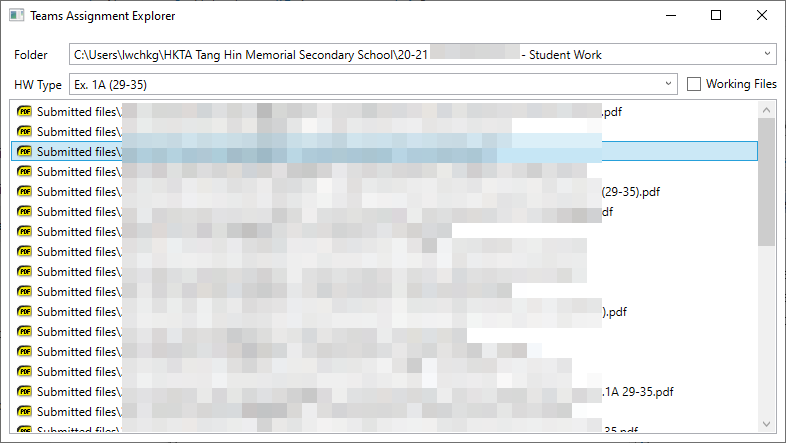
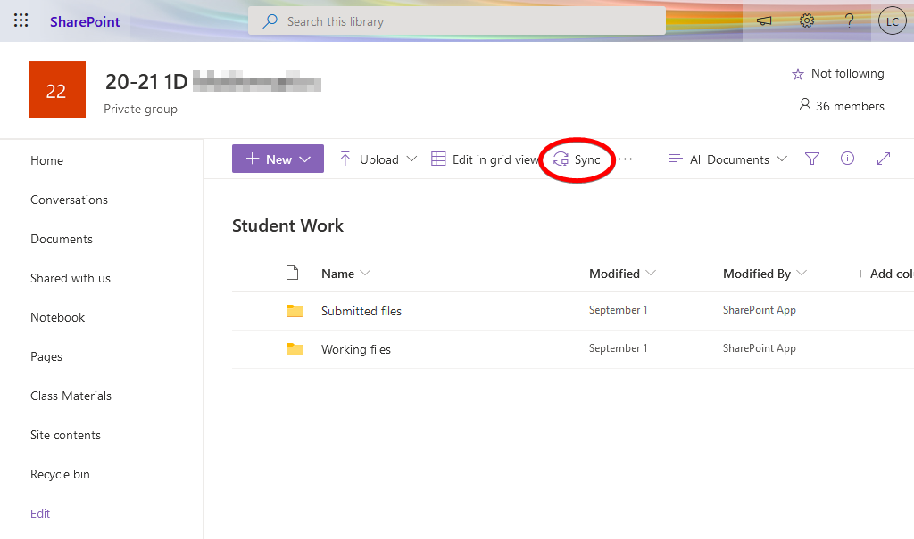

# Teams Assignment Explorer

This is a Windows desktop program to help you mark Microsoft Teams assignments in your PC.

## Why this program?

In Microsoft Teams, we are supposed to view and annotate assignments in an integrated interface.
Unfortunately, editing or annotating assignments is limited to Word, Excel, PowerPoint, and OneNote.

But for complex assignments (consider math and chemical equations), it is still preferred to write
on actual paper and upload by scanning to PDFs. In this way, it is impossible to mark assignment
inside Teams interface.

Teachers finally have found a way to annotate on those PDFs: using the OneDrive app on mobile
devices. However, the interface is so cluttered that about 5-10 clicks are needed to open each file:

*Libraries → [name of class] → Student work → Submitted files → **[name of student]** → **[name of
homework]** → [version number] → [name of the file]*

Imagine your class having 200 assignments at the end of the year. This is **unacceptable**. Hence
this program is here.

## Before you start

**You should be using Windows 10, version 1803 or above.**

You should know how to mark assignments using a mobile device. If not, see the
[appendix](#appendix-marking-assignments-in-your-mobile-device) below.

Follow the following steps:

1. Log in [Microsoft Office](https://www.office.com/) in the web interface.
2. Select SharePoint among the list of apps (the list starts with Word, Excel, PowerPoint...)
3. Click your desired item / class.
4. On the left sidebar, click “Site Contents”.
5. Click the “Student Work” folder.
6. Click the “Sync” button.
7. Press “Sync now”.
8. Open the link with “Microsoft OneDrive”.
9. Click through the installation process if you see it. Do not change the default settings.
10. Finish! Your files can be found in `C:\Users\[username]\[orgname]`.

## Using this program

See the [video demo](https://www.youtube.com/watch?v=BA1VlM0R1zQ&cc_load_policy=1) of the program.
Please turn on captions because I did not speak in the video. Or just refer to the instructions
below:

1. Finish the [before you start](#before-you-start) session in this page.
2. Start the program. (Download
   [here](https://github.com/lwchkg/teams_assignment_explorer/releases/).) See
   [the FAQ](#why-windows-do-not-allow-executing-this-program) if you cannot run the program.
3. Select a folder. (Click the dropdown button to select one.)
4. Select a homework. (Click the dropdown button again.)
5. The student work is now listed in a neat fashion. Double-click or press enter to open a file.
6. Edit the file as you wish. Remember to **save** your work.

## FAQ

### Why Windows do not allow executing this program?

As all small programs in the internet, it is blocked by Microsoft Defender SmartScreen by default.
You can do one of the following:

- Find a way to click through the warning. (e.g.
  [see the screenshots here](https://shixxnote.wordpress.com/2015/12/30/installing-program-on-windows-10/).)
- Or download the source code of the program, and then compile yourself. You need Visual Studio 2019
  Community to compile this program.

### I want to open the file in another app.

This program opens files with their associated apps. To change the associated apps, do the
following:

1. Find a file of the same type in Explorer.
2. Right click on the file.
3. In the context menu, select “Open with…”. Inside, choose “Choose another app”.
4. Select the app you want, and check “Always choose this app to open [filetype] files.”.
5. Press “OK”.

## Appendix: marking assignments in your mobile device

Here are the steps needed:

1. Open OneDrive app.
2. Find the “Libraries” button.
3. Follow this line of navigation: *Libraries → [name of class] → Student work → Submitted files →
   **[name of student]** → **[name of homework]** → [version number] → [name of the file]*
4. Now you can annotate on PDF files. No luck on plain images, sorry.
